# SERVIÇO DE REDES / PROJETO E INFRAESTRUTURA DE REDES

##### ELAINE CLIS DE MENEZES SILVA - 914
##### MARIA THAYSE NASCIMENTO DA SILVA - 914
##### LUCAS EMANUEL LIMA DA SILVA - 914

### Prof. Alaelson Jatobá

# CONFIGURAÇÕES DAS INTERFACES DE REDE

| IP da Subrede:  |  10.9.14.0/24  | 192.168.14.48/29  | 
| ------------------- | ------------------- | ------------------- |
|IP de Broadcast: |  10.9.14.255/24 | 192.168.14.55 | 
|IP do GW:| ens160: 10.9.14.128 | ens192: 192.168.14.49| 
|IP do SAMBA:| ens160: 10.9.14.122 | ens192: 192.168.14.50| 
|IP do NS1: | ens160: 10.9.14.107 | ens192: 192.168.14.51| 
|IP do NS2:| ens160: 10.9.14.117| ens192: 192.168.14.52| 
|IP do WEB | ens160: 10.9.14.223 | ens192: 192.168.14.53|
|IP do BD| ens160: 10.9.14.224 | ens192: 192.168.14.54|


# Definição de Nomes e Domínio (<grupo>.<turma>.ifalara.local):
	
| VM  |  Domínio (zona): | grupo7.turma914.ifalara.local  | 
| ------------------- | ------------------- | ------------------- |
|Aluno28 |  FQDN do GW: | gw.grupo7.turma914.ifalara.local | 
|Aluno22| FQDN do SAMBA: | smb.grupo7.turma914.ifalara.local| 
|Aluno07| FQDN do NS1:| ns1.grupo7.turma914.ifalara.local| 
|Aluno17 | FQDN do NS2: | ns2.grupo7.turma914.ifalara.local| 
|Grupo7VM(www)| FQDN do WEB| www.grupo7.turma914.ifalara.local| 
|Grupo7VM(bd) | FQDN do BD | bd.grupo7.turma914.ifalara.local|	
	
	
	
# [Acesse aqui os testes das máquinas](https://github.com/NanyDesu/Trabalho_final_Sred/tree/main/images/teste)
	
### NS1


#### VM configurada com (DNS) e o Bind9, utilizando-a como DNS Master. 

 
```	
$ sudo hostnamectl set-hostname ns1.grupo7.turma914.ifalara.local
```
	

	
##### Vamos realizar um update e instalar o bind9.

	
	
```	
$ sudo apt update
```
	
	

```
$ sudo apt-get install bind9 dnsutils bind9-doc
```
	
	
	
##### Verificação do Bind9 :
	
	
```
$ sudo systemctl status bind9
```
	
---

#####  Configuração de arquivos de zonas.
iremos precisar de um diretorio zones onde os nossos arquivos de zonas serão armazenados. Para realizar tal tarefa iremos utilizar o seguinte codigo: 
	
	
```
$ sudo mkdir /etc/bind/zones
```
	

	
--> Enviar arquivos para a pasta zones.

Zona Direta:


	
```
$ sudo cp /etc/bind/db.empty /etc/bind/zones/db.grupo7.turma914.ifalara.local
```
	
	
--> grupo7.turma914.ifalara.local nome de dominio

Zona Reversa:
	
	
	
	
```
$  sudo cp /etc/bind/db.127 /etc/bind/zones/db.10.9.14.rev
```

	
	

---> editar arquivo "db.grupo7.turma914.ifalara.local" ---> colocar ip´s e dns:
	
	
	
```
$ sudo nano /etc/bind/zones/db.grupo7.turma914.ifalara.local
```
	
	

#### Iremos obter a seguinte resposta:
	
	
	
```
;
; BIND data file for internal network
;
$ORIGIN grupo7.turma914.ifalara.local.
$TTL	3h
@	IN	SOA	ns1.grupo7.turma914.ifalara.local. root.grupo7.turma914.ifalara.local. (
			      2022031400		; Serial
			      3h	; Refresh
			      1h	; Retry
			      1w	; Expire
			      1h )	; Negative Cache TTL
;nameservers
@	IN	NS	ns1.grupo7.turma914.ifalara.local.
@	IN	NS	ns2.grupo7.turma914.ifalara.local.

;hosts
ns1.grupo7.turma914.ifalara.local.	  IN	A	10.9.14.107
ns2.grupo7.turma914.ifalara.local.	  IN	A	10.9.14.117
gw.grupo7.turma914.ifalara.local.	  IN 	A	10.9.14.128
smb.grupo7.turma914.ifalara.local.	  IN	A	10.9.14.122
www.grupo7.turma914.ifalara.local.	  IN 	A	10.9.14.223
bd.grupo7.turma914.ifalara.local.	  IN 	A	10.9.14.224
```
	
	
	
	
---	

---

	
	
---> editar o arquivo "db.10.9.14.rev" onde mais uma vez iremos adicionar os ip´s e os dns:
	

```
$ sudo nano /etc/bind/zones/db.10.9.14.rev
```
	
	
#### Iremos obter a seguinte resposta:
	
	
	
```
;
; BIND reverse data file of reverse zone for local area network 10.9.14.0/24
;
$TTL    604800
@       IN      SOA     grupo7.turma914.ifalara.local. root.grupo7.turma914.ifalara.local. (
                              2022031400         ; Serial
                         604800         ; Refresh
                          86400         ; Retry
                        2419200         ; Expire
                         604800 )       ; Negative Cache TTL

; name servers
@      IN      NS      ns1.grup7.turma914.ifalara.local.
@      IN      NS      ns2.grupo7.turma914.ifalara.local.

; PTR Records
107   IN      PTR     ns1.grupo7.turma914.ifalara.local.
117   IN      PTR     ns2.grupo7.turma914.ifalara.local.
128   IN      PTR     gw.grupo7.turma914.ifalara.local.
122   IN      PTR     smb.grupo7.turma914.ifalara.local.
223   IN      PTR     www.grupo7.turma914.ifalara.local.
224   IN      PTR     bd.grupo7.turma914.ifalara.local.
```

	
---	

---
	
	

##### Para tornar as zonas ativas , precisamos configurar o arquivo "named.conf.local":
	
	
```	
$  sudo nano /etc/bind/named.conf.local
```
	
---	
#### Iremos obter a seguinte resposta:
---	
	
	
	
	
```	
//
// Do any local configuration here
//

// Consider adding the 1918 zones here, if they are not used in your
// organization
//include "/etc/bind/zones.rfc1918";

Nele vamos adicionas as seguintes linhas de codigos logo a baixo, pulando uma linha:

zone "grupo7.turma914.ifalara.local" {
	type master;
	file "/etc/bind/zones/db.grupo7.turma914.ifalara.local";
	allow-transfer{ 10.9.14.117; };  
	allow-query{any;};
};

zone "14.9.10.in-addr.arpa" IN {
	type master;
	file "/etc/bind/zones/db.10.9.14.rev";
	allow-transfer{ 10.9.14.117; };
};
```
	
	
	
Nas zones devemos escolher um nome de dominio, Em "allow-transfer" o IP é o do ns2, ou seja Slave.
	
	
---

---


##### Iremos verificar a sintax do arquivo named.conf.local usando:
	
	
	
```
$ sudo named-checkconf
```
	
---	
---> para entrar no diretório zones utilize o comando abaixo:
---	

	
```
$ cd /etc/bind/zones
```
	
	
	
	
e para garantir que "db.grupo7.turma914.ifalara.local" está funcionando:
	
	
	
	
```
$ sudo named-checkzone grupo7.turma914.ifalara.local db.grupo7.turma914.ifalara.local
```
	
	
	
#### Iremos obter a seguinte resposta:

	
	
	
	
	
```
zone grupo7.turma914.ifalara.local/IN: loaded serial 1
OK
```
	
---	
Iremos Verificar se o arquivo "db.10.9.14.rev" está certo a partir de.
---	

	
```
$ sudo named-checkzone 14.9.10.in-addr.arpa db.10.9.14.rev
```	
	
#### Iremos obter a seguinte resposta:
	
```
zone 14.9.10.in-addr.arpa/IN: loaded serial 1
OK
```
	
	
	
---

	
	
##### Devemos então realizar uma configuração para apenas IPv4.
No arquivo name vamos adicionar "-4" na linha "OPTINS=-u bind"
	
	
	
```
$ sudo nano /etc/default/named
```
	
	
#### Iremos obter a seguinte resposta:
	
	
	
```
# run resolvconf?
RESOLVCONF=no
# startup options for the server
OPTIONS="-4 -u bind"
```
---

#### Reiniciando o bind:
```
$ sudo systemctl restart bind9
```
##### Configuração de interface:
```
$ sudo nano /etc/netplan/00-installer-config.yaml
	
---> Para a ens160 vamos manter apenas os endereçoes do Master e Sleve.
```	
#### Iremos obter a seguinte resposta:
```
network:
  ethernets:
    ens160:
      addresses: [10.9.14.107/24]
      gateway4: 10.9.14.1
      dhcp4: false
      nameservers:
        addresses:
          - 10.9.14.107
          - 10.9.14.117
        search: [grupo7.turma914.ifalara.local]
    ens192:
      addresses: [192.168.14.51/29]
  version: 2
```
#### Teste do DNS Master.
```
$ dig @10.9.14.128 gw.grupo7.turma914.ifalara.local
```
---> Na linha "ANSWER SECTION:" precisa aparecr o dominio e o IP juntamente com a informação se foi resolvido ou não.

---> Para verificar a funcionalidade da 160:
```
$ systemd-resolve --status ens160
```
---> Teste: resolvendo o DNS do google:
```
$ ping google.com
```
	


----


### NS2


#### Configuração do Dns Slave na máquina ns2.


#### Mudaremos o nome da maquina. 

```
$ sudo hostnamectl set-hostname ns1.grupo7.turma914.ifalara.local
```


### Instale o Bind9


---> De um update na máquina:


```
$ sudo apt update
```

---> Instale:

```
$ sudo apt-get install bind9 dnsutils bind9-doc
```

---> verifique o status:

```
$ sudo systemctl status bind9
```


#### Configuração da interfaces de redes:

```
$ sudo nano /etc/netplan/00-installer-config.yaml
```

#### Iremos obter a seguinte resposta:

```
# This is the network config written by 'subiquity'
network:
  ethernets:
    ens160:
      addresses: [10.9.14.117/24]
      gateway4: 10.9.14.1
      dhcp4: false
      nameservers:
        addresses:
          - 10.9.14.107
          - 10.9.14.117
        search: [grupo7.turma914.ifalara.local]
    ens192:
      addresses: [192.168.14.52/29]
      nameservers:
        addresses:
          - 192.168.14.49
          - 192.168.14.50
        search: [grupo7.turma914.ifalara.local]
  version: 2
```

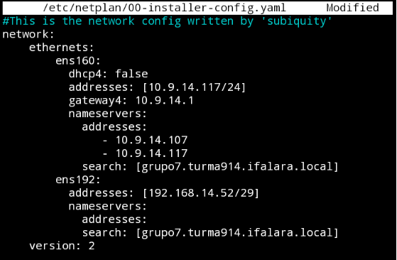


#### Vamos aplicar as alterações.


```
$ sudo netplan apply
```

#### Verifique se está tudo certo:

```
$ ifconfig
```


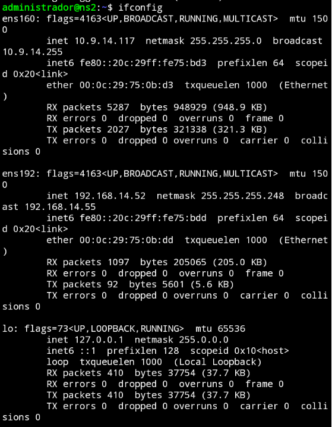


#### Verifique se o Bind esta funcionando:


```
$ sudo systemctl status bind9
```


#### vamos editar o arquivo "named.conf.local" para informar o que esse é o DNS Slave e o ip do DNS do Master. 

```
$ sudo nano /etc/bind/named.conf.local
```

#### RESULTADO:
```
//
// Do any local configuration here
//

// Consider adding the 1918 zones here, if they are not used in your
// organization
//include "/etc/bind/zones.rfc1918";

zone "grupo7.turma914.ifalara.local" {
        type slave;
        file "/etc/bind/zones/db.ifalara.local";
        masters { 10.9.14.107; };
};

zone "14.9.10.in-addr.arpa" IN {
        type slave;
        file "/etc/bind/zones/db.10.9.14.rev";
        masters { 10.9.14.107; };
};
```

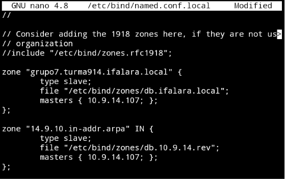


#### Verifique a sintax:

```
$ sudo named-checkconf
```

---> Se não aparecer erro então está tudo certo.


#### Teste se está funcionando:


```
$ systemd-resolve --status
```

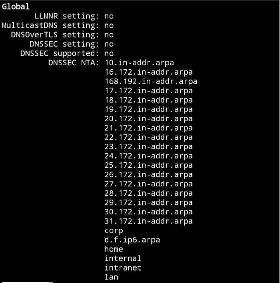


#### Teste se o DNS está retornando o do google.


```
$ ping google.com
```

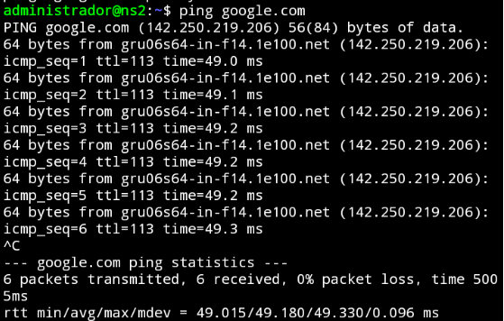


### Página Web

#### Configuração do servidor web da maquina "www" utilizando a ferramenta Apache2 e fazer a configuração da maquina como cliente do serviço DNS. 


---> Primeiro iremos mudar o nome da máquina:

```
$ sudo hostnamectl set-hostname www.grupo7.turma914.ifalara.local
```

---> Depois iremos configurar essa maquina como cliente do serviço DNS. 

```
$ sudo nano /etc/netplan/00-installer-config.yaml
```


#### Resultado

```
#This is the network config written by 'subiquity'
network:
    ethernets:
        ens160:
          dhcp4: false
          addresses: [10.9.14.117/24]
          gateway4: 10.9.14.1
          nameservers:
            addresses:
               - 10.9.14.107
               - 10.9.14.117
            search: [grupo7.turma914.ifalara.local]
        ens192:
          dhcp4: false
          addresses: [192.168.0.52/29]
    version: 2
```


---> Em seguida vamos aplicar as alterações:

```
$ sudo netplan apply
```


---> Na linha "ANSWER SECTION:" tem que aparecer que foi resolvido, com o dominio e o IP. Então iremos verificar se está funcionando:

```
$ systemd-resolve --status ens160
```


---> Para finalizar o processo iremos ver se o nosso serviço DNS revolve o DNS do google:

```
$ ping google.com
```


---> Iremos instalar o apache e configura-lo para subir nosso servidor apacha, fazendo um update na nossa máquina, via apt:

```
$ sudo apt update
```


---> Vamos instalar o apache2 na versão que utilizaremos:

```
$ sudo apt install apache2
```


---> Iremos verificar se o servidor web está funcionando:

```
$ sudo systemctl status apache2
```

#### Resultado:

```
● apache2.service - The Apache HTTP Server
     Loaded: loaded (/lib/systemd/system/apache2.service; enabled; vendor preset: enabled)
     Active: active (running) since Tue 2022-03-08 12:30:50 UTC; 4 days ago
       Docs: https://httpd.apache.org/docs/2.4/
   Main PID: 3630 (apache2)
      Tasks: 55 (limit: 1066)
     Memory: 7.0M
     CGroup: /system.slice/apache2.service
             ├─  3630 /usr/sbin/apache2 -k start
             ├─129424 /usr/sbin/apache2 -k start
             └─129425 /usr/sbin/apache2 -k start

Mar 08 12:30:50 www systemd[1]: Started The Apache HTTP Server.
Mar 10 00:00:29 www systemd[1]: Reloading The Apache HTTP Server.
Mar 10 00:00:29 www apachectl[51821]: AH00558: apache2: Could not reliably determine the serv>
Mar 10 00:00:29 www systemd[1]: Reloaded The Apache HTTP Server.
Mar 11 00:00:01 www systemd[1]: Reloading The Apache HTTP Server.
Mar 11 00:00:01 www apachectl[95559]: AH00558: apache2: Could not reliably determine the serv>
Mar 11 00:00:01 www systemd[1]: Reloaded The Apache HTTP Server.
Mar 12 00:00:37 www systemd[1]: Reloading The Apache HTTP Server.
Mar 12 00:00:37 www apachectl[129422]: AH00558: apache2: Could not reliably determine the ser>
Mar 12 00:00:37 www systemd[1]: Reloaded The Apache HTTP Server.
```


---> Então para acessar o servidor web basta ir ao navegador e colocar o IP da maquina "www", onde foi feita a instalação do Aopache2.


---> Iremos criar o nosso site. Primeiro vamos criar um diretorio com o nome do nosso domínio, utilisando:

```
$ sudo mkdir /var/www/grupo7.turma914.ifalara.local
```

---> Vamos atribuir a propriedade do diretório com a variável de ambiente $USER:

```
$ sudo chown -R $USER:$USER /var/www/grupo7.turma914.ifalara.local
```

---> Agora vamos fazer as configurações das permições dos webs hosts, com:

```
$ sudo chmod -R 755 /var/www/grupo7.turma914.ifalara.local
```

---> Depois vamos criar e editar a página index.html:

```
$ sudo nano /var/www/gupo7.turma914.ifalara.local/index.html
```

---> Pra apresentar a página criamos um arquivo de configuração:

```
$ sudo nano /etc/apache2/sites-available/grupo7.turma914.ifalara.local.conf
```

---> E neste arquivo iremos colocar o seguinte bloco de código:

```
<VirtualHost *:80>
    ServerAdmin webmaster@localhost
    ServerName grupo7.turma914.ifalara.local
    ServerAlias www.grupo7.turma914.ifalara.local
    DocumentRoot /var/www/grupo7.turma914.ifalara.local
    ErrorLog ${APACHE_LOG_DIR}/error.log
    CustomLog ${APACHE_LOG_DIR}/access.log combined
</VirtualHost>
```


---> Em segida iremos habilitar o arquivo com a ferramenta a2ensite:

```
$ sudo a2ensite grupo7.turma914.ifalara.local.conf
```

---> E vamos desabilitar o site padrão:

```
$ sudo a2dissite 000-default.conf
```

---> Teste para erros de configuração:

```
$ sudo apache2ctl configtest
```

---> Então iremos reiniciar o Apache:

```
$ sudo systemctl restart apache2
```

	
---> Pronto agora é só acessar novamente no navegador com o IP da máquina. 


### BD


#### Configurando o MySql: 


#### Mudaremos o nome da maquina. 

```
$ sudo hostnamectl set-hostname bd.grupo7.turma914.ifalara.local
```


#### Vamos configurar a maquina para se tornar cliente do serviço DNS.


```
$ sudo nano /etc/netplan/00-installer-config.yaml
```

#### Iremos obter a seguinte resposta:

```
#This is the network config written by 'subiquity'
network:
    ethernets:
        ens160:
          dhcp4: false
          addresses: [10.9.14.224/24]
          gateway4: 10.9.14.1
          nameservers:
            addresses:
               - 10.9.14.107
               - 10.9.14.117
            search: [grupo7.turma914.ifalara.local]
        ens192:
          dhcp4: false
          addresses: [192.168.0.54/29]
    version: 2
```


#### Vamos aplicar as alterações.


```
$ sudo netplan apply
```

#### Teste se está funcionando.

```
$ dig @10.9.14.107 gw.grupo7.turma914.ifalara.local
```

#### Verifique se na linha "ANSWER SECTION:" apareceu que foi resolvido, com o dominio e o IP.


#### Vamos verificar se a interface 160 está funcionando:

```
$ systemd-resolve --status ens160
```

#### Veja se o serviço DNS está resolvendo o DNS do google:


```
$ ping google.com
```


### SAMBA


#### Configurando o serviço de compartilhamento de arquivos Samba:


#### Mudaremos o nome da maquina. 

```
$ sudo hostnamectl set-hostname smb.grupo7.turma914.ifalara.local
```


#### Vamos configurar a maquina para se tornar cliente do serviço DNS.


```
$ sudo nano /etc/netplan/00-installer-config.yaml
```

#### Iremos obter a seguinte resposta:

```
#This is the network config written by 'subiquity'
network:
    ethernets:
        ens160:
          dhcp4: false
          addresses: [10.9.14.122/24]
          gateway4: 10.9.14.1
          nameservers:
            addresses:
               - 10.9.14.107
               - 10.9.14.117
            search: [grupo7.turma914.ifalara.local]
        ens192:
          dhcp4: false
          addresses: [192.168.0.50/29]
    version: 2
```

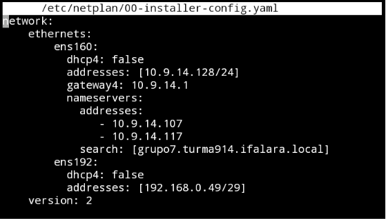


#### Vamos aplicar as alterações.


```
$ sudo netplan apply
```

#### Teste se está funcionando.

```
$ dig @10.9.14.107 gw.grupo7.turma914.ifalara.local
```

---> Verifique se na linha "ANSWER SECTION:" apareceu que foi resolvido, com o dominio e o IP.


---> Vamos verificar se a interface 160 está funcionando:

```
$ systemd-resolve --status ens160
```

#### Veja se o serviço DNS está retornando o DNS do google:


```
$ ping google.com
```

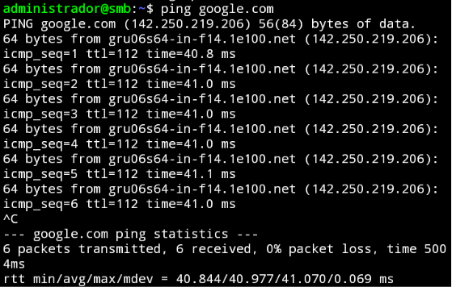


### Instale o Samba


---> De um update na máquina:


```
$ sudo apt update
```

---> Instale:

```
$ sudo apt install samba 
```

---> verifique o status:

```
$ sudo systemctl status smbd
```

---> Iremos obter a seguinte resposta:


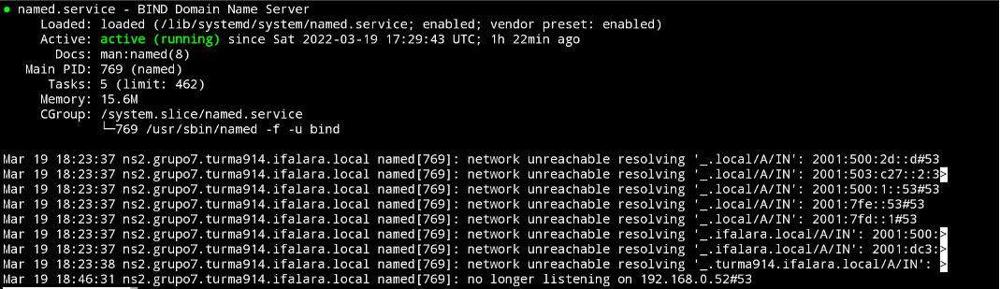


---> Verifique se na maquina as portas TCP 445 e 136 estão rodando. 

```
$ netstat -an | grep LISTEN
```


#### Backup do arquivo de configuração do samba e criando um novo:


```
$ sudo cp /etc/samba/smb.conf{,.backup}
```


---> Verifique se foi criado um novo arquivo.

```
$ ls -la /etc/samba
```

---> Iremos obter a seguinte resposta:

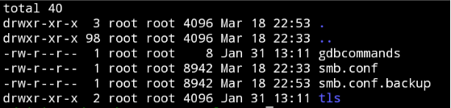


---> Usando o comando grep remova os comentarios dos arquivos.


```
$ sudo bash -c 'grep -v -E "^#|^;" /etc/samba/smb.conf.backup | grep . > /etc/samba/smb.conf'
```

---> Vamos editar o arquivo de configurações do samba.

```
$ sudo nano /etc/samba/smb.conf
```

---> Deixando ele dessa maneira:


```
[global]
   workgroup = WORKGROUP
   netbios name = samba-srv
   security = user
   server string = %h server (Samba, Ubuntu)
   interfaces = 127.0.0.1/8 ens160 ens192
   bind interfaces only = yes
   log file = /var/log/samba/log.%m
   max log size = 1000
   logging = file
   panic action = /usr/share/samba/panic-action %d
   server role = standalone server
   obey pam restrictions = yes
   unix password sync = yes
   passwd program = /usr/bin/passwd %u
   passwd chat = *Enter\snew\s*\spassword:* %n\n *Retype\snew\s*\spassword:* %n\n *password\supdated\ssuccessfully* .
   pam password change = yes
   map to guest = bad user
   usershare allow guests = yes
[printers]
   comment = All Printers
   browseable = no
   path = /var/spool/samba
   printable = yes
   guest ok = no
   read only = yes
   create mask = 0700
[print$]
   comment = Printer Drivers
   path = /var/lib/samba/printers
   browseable = yes
   read only = yes
   guest ok = no
[homes]
   comment = Home Directories
   browseable = yes
   read only = no
   create mask = 0700
   directory mask = 0700
   valid users = %S
[public]
   comment = public anonymous access
   path = /samba/public
   browsable =yes
   create mask = 0660
   directory mask = 0771
   writable = yes
   guest ok = yes
   guest only = yes
   force user = nobody
   force create mode = 0777
   force directory mode = 0777
```
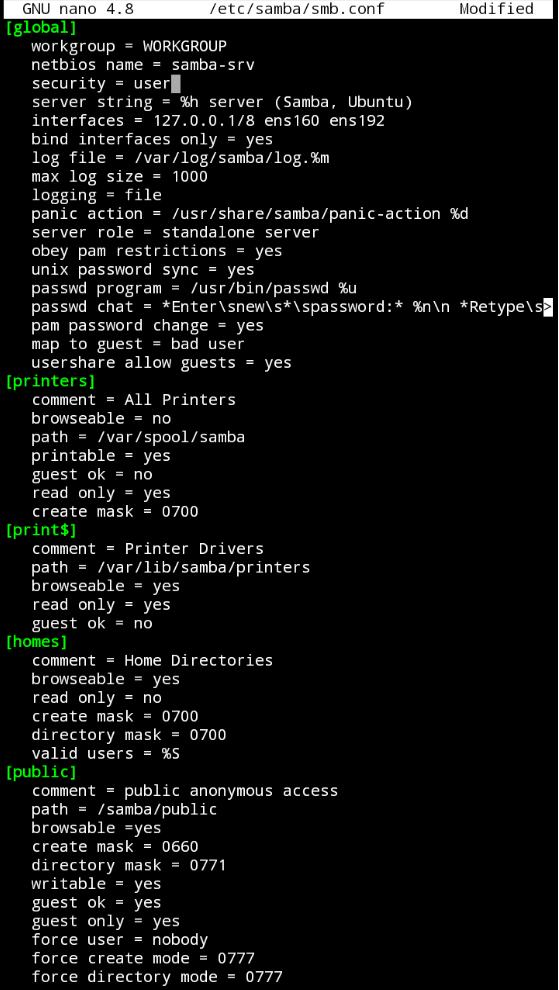

---> Modifique a pasta public para que apenas os usuarios do grupo sambashare possam acessar:

```
[public]
   comment = public anonymous access
   path = /samba/public
   browsable =yes
   create mask = 0660
   directory mask = 0771
   writable = yes
   guest ok = no
   valid users = @sambashare
   #guest only = yes
   #force user = nobody
   #force create mode = 0777
   #force directory mode = 0777
```

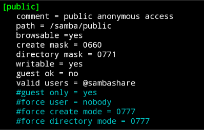


---> Reinicie o servidor

```
$ sudo systemctl restart smbd
```


#### Verificação do funcionamento das portas 445 e 139 nas interfaces ens160 e ens192

```
$ netstat -an | grep LISTEN
```

---> Iremos obter a seguinte resposta:


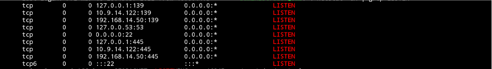


#### Crie um usuario: ``aluno``, com a senha: ``alunoifal``:

```
$ sudo adduser aluno
```

---> Iremos obter a seguinte resposta:


```
Adding user `aluno' ...
Adding new group `aluno' (1001) ...
Adding new user `aluno' (1001) with group `aluno' ...
Creating home directory `/home/aluno' ...
Copying files from `/etc/skel' ...
New password: 
Retype new password: 
passwd: password updated successfully
Changing the user information for aluno
Enter the new value, or press ENTER for the default
    Full Name []: Aluno de SRED no IFAL Arapiraca
    Room Number []: 
    Work Phone []: 
    Home Phone []: 
    Other []: 
Is the information correct? [Y/n] y
```

---> Vincule esse usuário ao serviço samba usamos:


```
$ sudo usermod -aG sambashare aluno
```

---> Crie um diretorio com compartilhamento em rede.

```
$ sudo mkdir /home/aluno/sambashare
```

```
$ sudo mkdir -p /samba/public
```


---> Altere a permição da pasta public

```
$ sudo chown -R nobody:nogroup /samba/public
```

```
$ sudo chmod -R 0775 /samba/public
```

```
$ sudo chgrp sambashare /samba/public
```


####  Teste no explorador de arquivos:


---> Em rede digite na barra de rotas o IP:

```
\\10.9.14.122
```


---> Como resultado mostrará as nossas pastas.


---> Com o DNS já implementado acesse usando o nome da maquina ``smb`` de IP: ``10.9.14.122``


```
\\smb.grupo7.turma914.ifalara.local
```


--> Para acessar a pasta public use o usuario: ``aluno`` e a senha: ``alunoifal``


---> Agora teste criando um arquivo no explorador de arquivos.


	
	
### Gateway


- Iremos configurar o servidor gateway como NAT
- Habilitar e configurar

#### Iniciando:


#### Mudaremos o nome da maquina. 

```
$ sudo hostnamectl set-hostname bd.grupo7.turma914.ifalara.local
```

---> Habilitar o firewall.

```
 sudo ufw enable
```

---> Permitir acesso ssh.


```
 sudo ufw allow ssh
```


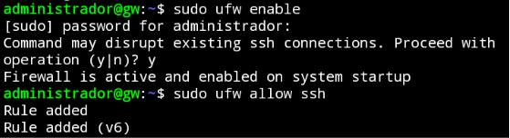


---> Encaminhamento de pacotes de wan para lan.

```
 sudo nano /etc/ufw/sysctl.conf
``` 

---> Remova a marca "#" do comentário.


```
...
net/ipv4/ip_forwarding=1
...
```


[/etc/ufw/sysctl.conf](images/GW/sysctl.conf.png)


---> Confira os nomes das interface interna e externa.

```
 ifconfig -a
```

```
WAN interface: ens160
LAN interface: ens192
```


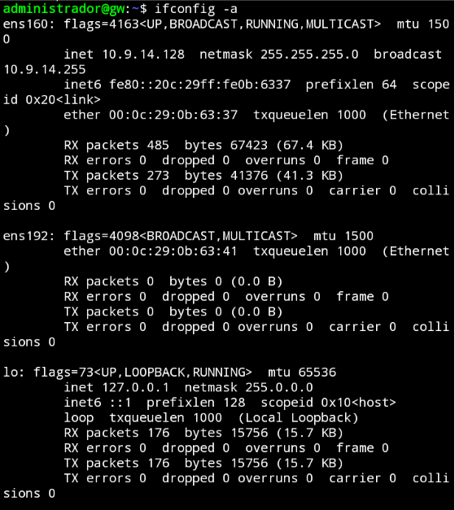


---> Recriando o arquivo /etc/rc.local.

```
 sudo nano /etc/rc.local
```

```
#!/bin/bash

# /etc/rc.local

# Default policy to drop all incoming packets.

iptables -P INPUT DROP
iptables -P FORWARD DROP

# Accept incoming packets from localhost and the LAN interface.

iptables -A INPUT -i lo -j ACCEPT
iptables -A INPUT -i enp192 -j ACCEPT

# Accept incoming packets from the WAN if the router initiated the connection.
#
iptables -A INPUT -i enp160 -m conntrack \

# rc.local needs to exit with 0
# rc.local precisa sair com 0
exit 0
```


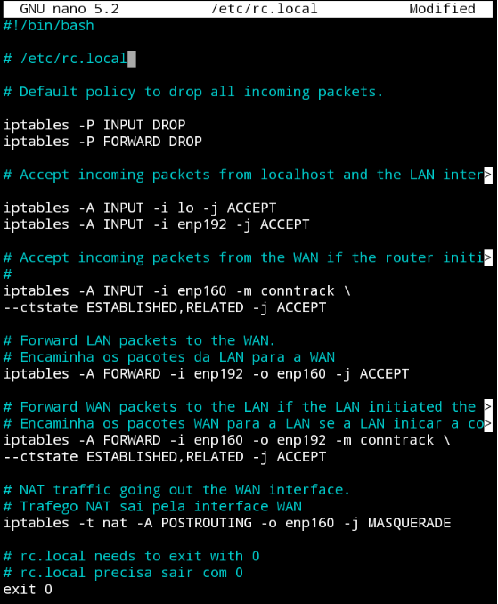


---> Torne o arquivo executável.


```
 sudo chmod 755 /etc/rc.local
```


---> Verifique a atividade do firewall.


```
 sudo ufw status
```

ou 

```
 systemctl status ufw.service
```

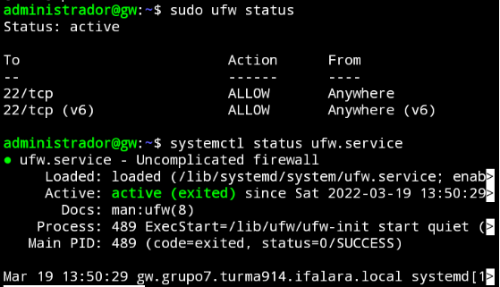


---> Reinie a máquina.

```
 sudo reboot
```


---> Recebe de pacotes na porta 445 e 139 da interface externa do gw e encaminha para o servidor interno na porta 445 e 139.


        
```
#Recebe pacotes na porta 445 da interface externa do gw e encaminha para o servidor interno na porta 445
iptables -A PREROUTING -t nat -i enp160 -p tcp –-dport 445 -j DNAT –-to 10.9.14.122:445
iptables -A FORWARD -p tcp -d 10.9.14.122 –-dport 445 -j ACCEPT

#Recebe pacotes na porta 139 da interface externa do gw e encaminha para o servidor interno na porta 139
iptables -A PREROUTING -t nat -i enp160 -p tcp –-dport 139 -j DNAT –-to 10.9.14.122:139
iptables -A FORWARD -p tcp -d 10.9.14.122 –-dport 445 -j ACCEPT
```


---> Recebe pacotes na porta 53 da interface externa do gw e encaminha para o servidor DNS Master interno na porta 53.


```
#Recebe pacotes na porta 53 da interface externa do gw e encaminha para o servidor DNS Mas interno na porta 53
iptables -A PREROUTING -t nat -i enp160 -p tcp –-dport 53 -j DNAT –-to 10.9.14.107:53
iptables -A FORWARD -p udp -d 10.9.14.107 –-dport 53 -j ACCEPT
```


---> Recebe pacotes na porta 80 da interface externa do gw e encaminha para o servidor Web na porta 80.

```
#Recebe pacotes na porta 80 da interface externa do gw e encaminha para o servidor Web na porta 80
iptables -A PREROUTING -t nat -i enp160 -p tcp –-dport 80 -j DNAT –-to 10.9.14.223:53
iptables -A FORWARD -p udp -d 10.9.14.223 –-dport 53 -j ACCEPT
```


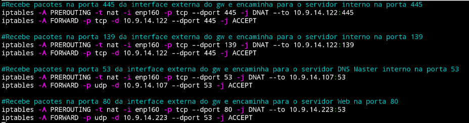


#### Em todas as máquinas: ``ns1``, ``ns2``, ``smb``, ``www`` e ``bd`` , indique que a máquina ``gw`` que é o nosso gateway:


```
$ sudo nano /etc/netplan/00-installer-config.yaml
```

---> Adicione na interface ens160:

```
#gateway4: 10.9.14.1
```


---> Adicione na interface ens192:

```
gateway4: 192.168.14.49
```


